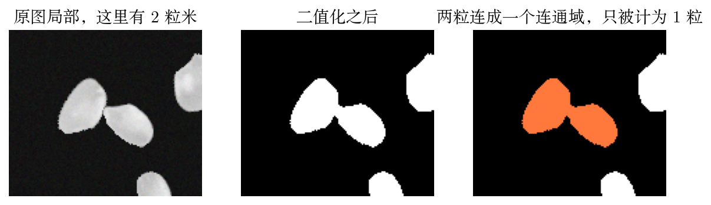
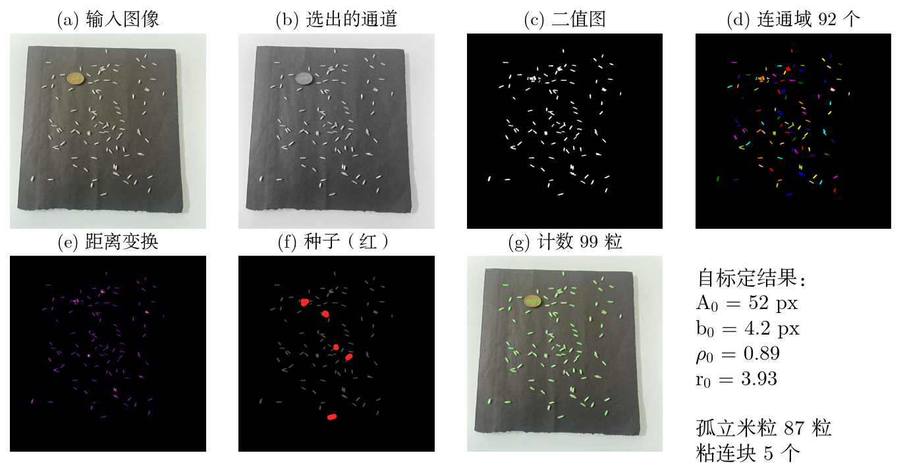
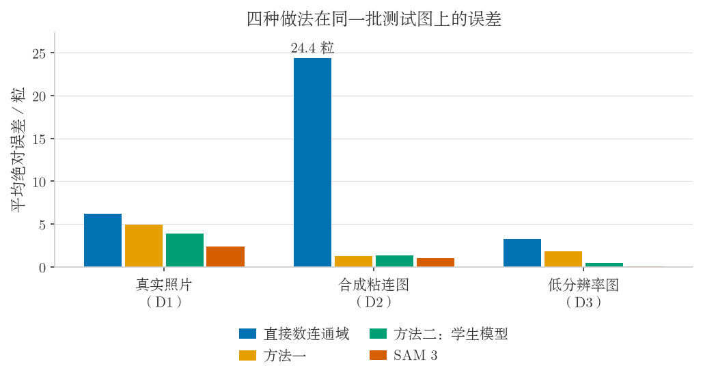
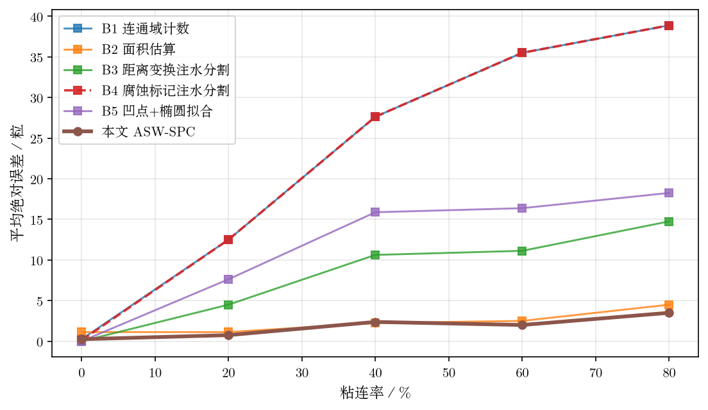
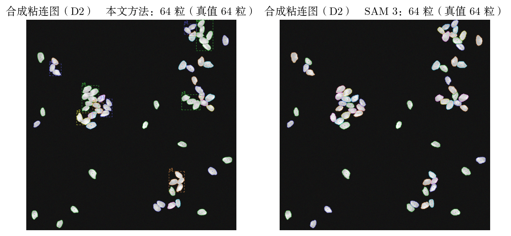

# 粘连米粒计数（ASW-SPC）

数出照片里有多少粒米，并解决相互接触的米粒被算作一粒的问题。

用「二值化 + 统计连通域」数米粒时，挨在一起的米粒会连成一块、只被计为一粒，米粒越密漏计越多：
粘连率 80% 时平均少数 38.9 粒。本仓库给出两种做法，并把两者与视觉大模型 SAM 3 放在一起比较。



**方法一（几何方法）**：先由图像自身量出单粒米的面积与形状，据此判定哪些连通域是粘连块、
控制注水分割（watershed）的种子数量，再按面积与形状复核切分结果，并剔除硬币、木框等非米目标。
所有判据都以自标定的尺度为单位，不含写死的像素常数。



单粒面积、短轴、凸实度都由图像自身量出，因此换一张照片不必改参数。
判定为粘连的连通域再单独走一遍注水分割，种子数由距离变换的局部极大值给出：


**方法二（学生模型）**：以 SAM 3 的输出为伪标签，蒸馏一个 27 万参数的密度图网络，
在同一批测试图上误差低于方法一，而模型体积约为 SAM 3 的三千分之一。
伪标签的质量先与人工标注核对过，教师点的准确率在两组真实数据上为 0.957 与 0.993。



## 结果

三组数据上的平均绝对误差（粒，越小越好）：

| 方法 | 真实照片 | 合成粘连图 | 低分辨率图 |
|---|---|---|---|
| 直接统计连通域 | 6.31 | 22.95 | 3.31 |
| 总面积除以单粒面积 | 22.76 | 2.30 | 18.39 |
| 距离变换分水岭 | 74.90 | 8.20 | 8.27 |
| 腐蚀取标记分水岭 | 5.45 | 22.93 | 4.29 |
| 凹点检测 + 椭圆拟合 | 5.76 | 2.08 | 3.32 |
| **方法一（本仓库）** | **4.73** | **1.77** | **1.93** |
| SAM 3（零样本，逐数据集调优） | 3.61 | 72.15 | 0.18 |

粘连率自 0% 升至 80% 时，直接统计连通域的误差由 0.25 粒升至 38.88 粒，方法一保持在 3.5 粒以内：



同一张合成粘连图上，方法一与 SAM 3 的逐粒结果。虚线框标出的是没有真正切开、而是按面积折算粒数的粘连块，框上的数字为该块被计作几粒：



在留出的 162 张测试图上，四种做法的总体误差为：直接统计连通域 4.46、方法一 1.95、
方法二 0.68、SAM 3 0.25 粒。

单张耗时（i9-13900H / RTX 4080 Laptop）：方法一 CPU 0.03–0.63 s、GPU 0.15–0.40 s，
学生模型 GPU 2–25 ms，SAM 3 GPU 0.21 s、CPU 17 s 以上。

## 安装

```bash
pip install -r requirements.txt
```

只跑方法一不需要 GPU。与 SAM 3 的对照实验和学生模型需要 PyTorch 与一块显卡；
GPU 版的几何方法另需 CuPy 与 cuCIM（见 `requirements.txt` 中的注释）。

插图上的字体与报告正文一致，西文取 Latin Modern Roman、中文取方正书宋，
找不到时按候选列表回退。也可以用环境变量直接指定字体文件：

```bash
export RICE_LATIN_FONT=/path/to/lmroman10-regular.otf
export RICE_CJK_FONT=/path/to/your/cjk-font.ttf
```

## 数据

三组数据都不随仓库分发，请自行获取后放入 `data/`：

| 代号 | 内容 | 来源 |
|---|---|---|
| D1 | 真实照片，51 张，含参照硬币 | [Roboflow: rice v1](https://universe.roboflow.com/annotation-gnc0j/rice-nqqbr)（CC BY 4.0） |
| D3 | 低分辨率 224×224，去重后 719 张 | [Roboflow: RICE v3](https://universe.roboflow.com/ezekiel-se47x/rice-ljhi4)（CC BY 4.0） |
| D2 的米粒素材 | 单粒米照片（Karacadag 品种） | [Roboflow: RICE v2](https://universe.roboflow.com/thanaree/rice-fgvkm)（CC BY 4.0） |

按 COCO 格式下载后解压到 `data/rice.v1i.coco/`、`data/RICE.v3i.coco/`、`data/RICE.v2i.folder/`。

D2（自制可控粘连合成图）由代码按固定随机种子生成，无需下载：

```bash
python -m src.synth          # 生成 40 张合成图与精确真值
```

## 复现

```bash
python -m src.evaluate       # 三组数据上的总体结果、按粘连率分层
python -m src.ablation       # 消融实验
python -m src.robustness     # 模糊/噪声/对比度/分辨率退化
python -m src.cost           # 耗时与显存占用
python -m src.visualize      # 论文插图
```

与 SAM 3 相关的部分（需要显卡和已下载的权重）：

```bash
python -m src.teacher_sam --matrix   # 提示词 × 数据集的误差矩阵
python -m src.pseudo                 # 由 SAM 3 生成伪标签
python -m src.student                # 训练学生模型
python -m src.student --eval         # 学生模型与其他做法的对比
```

批量处理自己的照片：

```bash
python -m src.batch 图片目录 --out counts.csv
```

## 代码结构

| 文件 | 职责 |
|---|---|
| `preprocess.py` | 多候选二值化与打分选择 |
| `calibrate.py` | 尺度自标定、区域属性测量 |
| `segment.py` | 粘连判据、自适应种子、注水分割 |
| `correct.py` | 碎块合并、按面积补数 |
| `counter.py` | 计数主流程 |
| `baselines.py` | 五种对比方法 |
| `synth.py` | 可控粘连合成数据生成 |
| `evaluate.py` / `ablation.py` / `robustness.py` / `cost.py` | 评测、消融、退化、算力 |
| `teacher_sam.py` / `pseudo.py` / `student.py` | SAM 3 对照、伪标签、学生模型 |
| `gpu_pipeline.py` | 几何方法的 GPU 实现（CuPy + cuCIM） |
| `batch.py` | 批量处理，含线程数设置 |
| `visualize.py` / `render.py` / `report_tables.py` | 插图与表格生成 |

## 一点实现经验

- **线程不是越多越好。** 标定中有大量很小的矩阵运算，OpenBLAS 默认开 20 个线程去应付，
  处理一张图会占满 17 个核，反而更慢。锁成单线程后单张快 1.6–1.8 倍，再按图多进程并行才有效果。
- **先测量再优化。** 最初以为瓶颈在逐像素运算，profile 后发现 98% 的时间花在逐个连通域算凸包上；
  把判断顺序调整为「先按得分排序、再从高到低检查」之后，绝大多数凸包不必再算，D2 由 6.6 s 降到 0.63 s，
  且计数结果与优化前逐张一致。
- **图像很小时 GPU 更慢。** 224×224 的图上 GPU 版比 CPU 版慢一倍，核函数启动开销超过了计算本身。

## 报告

`report/` 下是课程报告的 LaTeX 源码与编译好的 PDF。需要 XeLaTeX 与 ctex：

```bash
cd report && xelatex tpl_cjournal && bibtex tpl_cjournal && xelatex tpl_cjournal && xelatex tpl_cjournal
```

## 许可

代码以 MIT 许可发布，见 `LICENSE`。三组数据的版权归原作者，均为 CC BY 4.0，使用时请按其要求署名。
