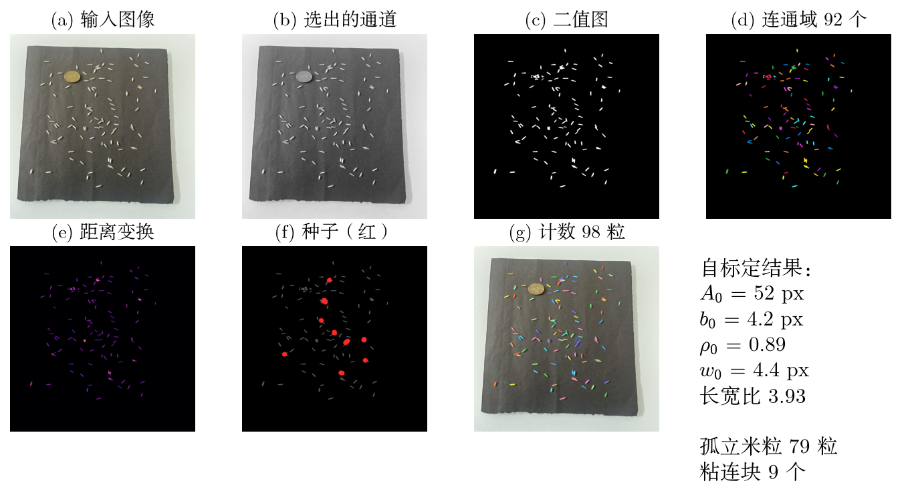
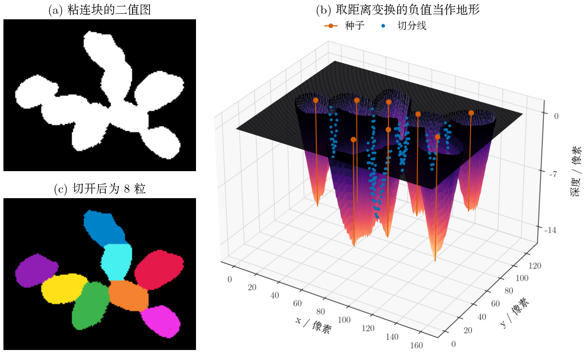
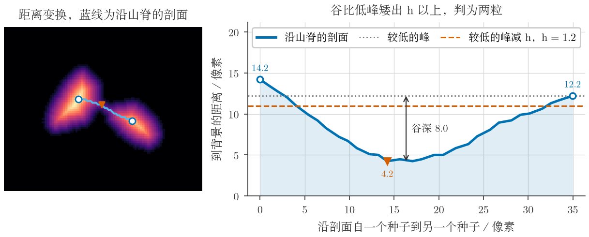
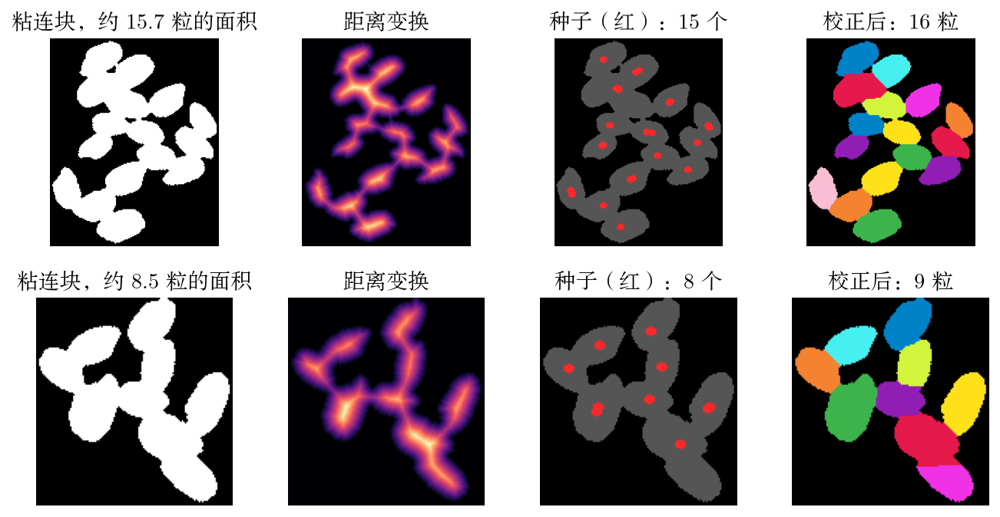
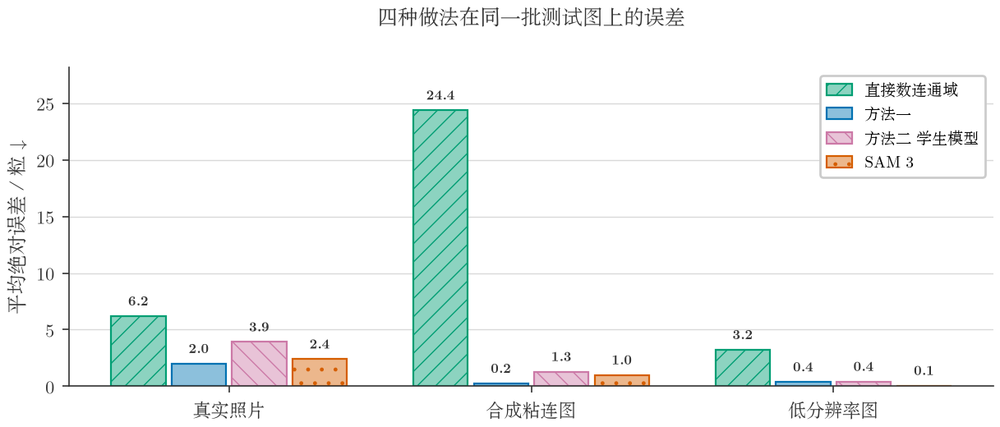
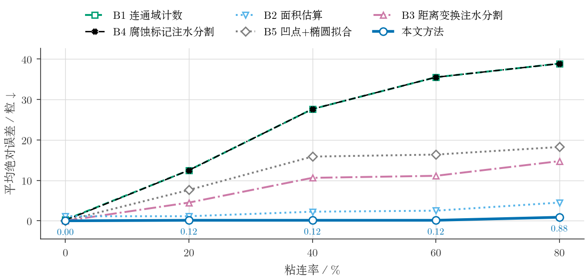
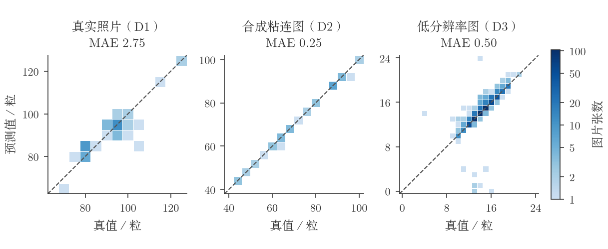

# 粘连米粒计数

这是一份数字图像处理课堂作业，要数出照片里有多少粒米，并解决相互接触的米粒被算作一粒的问题。

用“二值化 + 统计连通域”数米粒时，挨在一起的米粒会连成一块，只被计为一粒，米粒越密漏数越多，
粘连率 80% 时平均每张少数 38.9 粒。本仓库给出两种做法，并和视觉大模型 SAM 3 放在一起比较。


## 方法一，几何方法

程序先从当前图像里量出单粒米的面积、短轴和形状，据此判断哪些连通域是粘连块，
再用距离变换加标记分水岭把粘连块切开，按面积和形状复核切分结果，
剔除硬币、木框边的亮条和阴影这类不是米的东西，
最后回到去噪前的阈值图，把被开运算抹掉的细小米粒找回来。
各项判据都以自标定的单粒尺度为单位，没有预先定死的像素门限，换一张照片不必改参数。



判为粘连的连通域单独做一次分水岭。把距离变换取负当作地形，每粒米是一个坑，
水从坑底往上涨，两个坑的水相遇的地方就是切线。



种子由距离变换的 h-maxima 给出。两粒之间的谷比矮的那个峰低出 h 以上才切开，
一粒米内部的浅起伏会被抹平，不会被切成两半。





## 方法二，学生模型

用 SAM 3 的输出当伪标签，蒸馏出一个 27 万参数的密度图网络，权重文件约 1 MB，是 SAM 3 的三千分之一左右。
伪标签先和人工标注核对过，教师给出的点在 D3 上准确率 0.993，在 D1 上 0.957。
在同一批 162 张测试图上，学生模型平均每张误差 0.68 粒，不及方法一的 0.48 粒，
但它不依赖二值化，不会因为二值化选错而整张数错。



## 结果

三组数据上每张图的平均绝对误差，单位为粒，越小越好。

| 方法 | D1 真实照片 | D2 合成粘连图 | D3 低分辨率图 |
|---|---|---|---|
| 直接统计连通域 | 6.31 | 22.95 | 3.31 |
| 总面积除以单粒面积 | 22.76 | 2.30 | 18.39 |
| 距离变换分水岭 | 74.90 | 8.20 | 8.27 |
| 腐蚀取标记分水岭 | 5.45 | 22.93 | 4.29 |
| 凹点检测 + 椭圆拟合，每组取最好的配置 | 5.76 | 2.08 | 3.32 |
| **方法一** | **2.75** | **0.25** | **0.50** |
| SAM 3 零样本 | 3.61 | 72.15 | 0.18 |

粘连率从 0% 升到 80% 时，直接统计连通域的误差从 0.25 粒升到 38.88 粒，方法一一直在 0.9 粒以内。



下图是方法一逐张的预测值与真值，格子越深，落在该格的图越多，虚线表示两者相等。



同一张合成粘连图上方法一与 SAM 3 的逐粒结果，每粒米涂一种颜色，相邻的米粒颜色不同。


单张耗时在一台 i9-13900H 加 RTX 4080 Laptop 的笔记本上测得。方法一 CPU 版 0.04 到 1.44 秒，GPU 版 0.08 到 1.25 秒，
学生模型 GPU 上 2 到 25 毫秒，SAM 3 GPU 上 0.21 秒、CPU 上 17 秒以上。

报告里用到的源文件、图、表、指标、原始数据压缩包、学生模型权重和教师伪标签都在仓库里。
克隆下来不用重跑实验就能编译报告，核心的几何实验也可以从原始数据重新算。

## 安装

```bash
git clone https://github.com/stars-spark/asw-spc-rice-counting.git
cd asw-spc-rice-counting
python -m venv .venv
source .venv/bin/activate
pip install -r requirements.txt
```

国内访问 GitHub 慢的话，可以换成 Gitee 上的同一份仓库 https://gitee.com/flashy_dreams/asw-spc-rice-counting 。

编译报告需要 XeLaTeX、BibTeX 和中文 `ctex` 宏包。没有 GPU 也能跑几何方法、生成指标表、编译报告；
SAM 3 的推理要另装 `transformers` 并下载模型权重。

插图上的字体和报告正文一致，西文用 Latin Modern Roman，中文用方正书宋，找不到时按候选列表回退。
也可以用环境变量直接指定字体文件。

```bash
export RICE_LATIN_FONT=/path/to/lmroman10-regular.otf
export RICE_CJK_FONT=/path/to/your/cjk-font.ttf
```

## 直接编译报告

```bash
make report
```

输出文件是 `report/米粒粘连导致漏数的问题与解决.pdf`。公开仓库里没有 `report/author.tex`，
所以编译出来的版本没有作者行，正文、图表、参考文献和页码都不受影响。

## 从数据重新计算核心实验

四个 Roboflow 原始导出包在 `data/` 下，许可、来源和目录对应关系见 [data/README.md](data/README.md)。
下面的命令会解压数据，用固定随机种子生成 D2，重算几何方法、五个基线、消融和鲁棒性实验，再生成报告里的表格。

```bash
make core
make tables
```

`results/cache/`、`results/synthetic/` 和 `results/renders/` 是可以重新生成的大文件，没有放进仓库。
报告要用的 `results/figures/`、`results/metrics/`、`results/labels/` 和 `results/student/` 都已提交。

重新生成报告里不需要运行 SAM 3 的插图，先准备好数据再运行下面的命令，它会用仓库里的学生模型和教师伪标签。

```bash
make figures
```

方法一与 SAM 3 的三张逐粒对比图、附录里的六张图要真正运行 SAM 3，附录用哪几个场景写在 `src/visualize.py` 的 `APPENDIX_SCENES` 里。

```bash
make figures-sam3
```

## 重新运行 SAM 3 与学生模型

从头重跑教师模型和训练学生模型，需要额外的依赖、一块能用的 GPU，并先下载 Meta 的 SAM 3 权重。

```bash
pip install transformers
python -m src.teacher_sam --matrix   # 提示词 × 数据集的误差矩阵
python -m src.pseudo                 # 由 SAM 3 生成伪标签
python -m src.student                # 训练学生模型
python -m src.student --eval         # 学生模型与其他做法对比
```

这部分的耗时和部分中间结果会随硬件、模型版本和随机数状态变化，报告里用的是仓库中保存的那一次的指标。

批量数自己的照片，用下面的命令。

```bash
python -m src.batch 图片目录 --out counts.csv
```

## 代码结构

| 文件 | 内容 |
|---|---|
| `preprocess.py` | 多候选二值化与打分选择 |
| `calibrate.py` | 尺度自标定、区域属性测量 |
| `segment.py` | 粘连判据、自适应种子、分水岭、异物和阴影判据 |
| `correct.py` | 碎块合并、按面积补数 |
| `counter.py` | 计数主流程，找回被开运算抹掉的米粒 |
| `baselines.py` | 五种对比方法 |
| `synth.py` | 可控粘连合成数据 |
| `evaluate.py` / `ablation.py` / `robustness.py` / `cost.py` | 评测、消融、退化实验、耗时 |
| `teacher_sam.py` / `pseudo.py` / `student.py` | SAM 3 对照、伪标签、学生模型 |
| `gpu_pipeline.py` | 几何方法的 GPU 实现，用 CuPy 和 cuCIM |
| `batch.py` | 批量处理，含线程数设置 |
| `visualize.py` / `render.py` / `report_tables.py` | 插图和表格 |

## 一点实现经验

- 线程不是越多越好。标定里有大量很小的矩阵运算，OpenBLAS 默认开 20 个线程，
  处理一张图会占满 17 个核，反而更慢。锁成单线程后单张快 1.6 到 1.8 倍，再按图多进程并行才有效果。
- 先测量再优化。最初以为慢在逐像素运算，做了性能剖析才发现时间几乎都花在逐个连通域算凸包上。
  把检查顺序改成先按分数排序、再从高到低逐个检查以后，多数凸包不用再算，计数结果逐张不变。
- 图很小时 GPU 反而慢。224×224 的图上 GPU 版比 CPU 版慢约一倍，核函数启动的开销超过了计算本身。

## 许可

代码采用 MIT 许可。数据集保留原来的 CC BY 4.0 许可和署名，详见 [data/README.md](data/README.md)。
